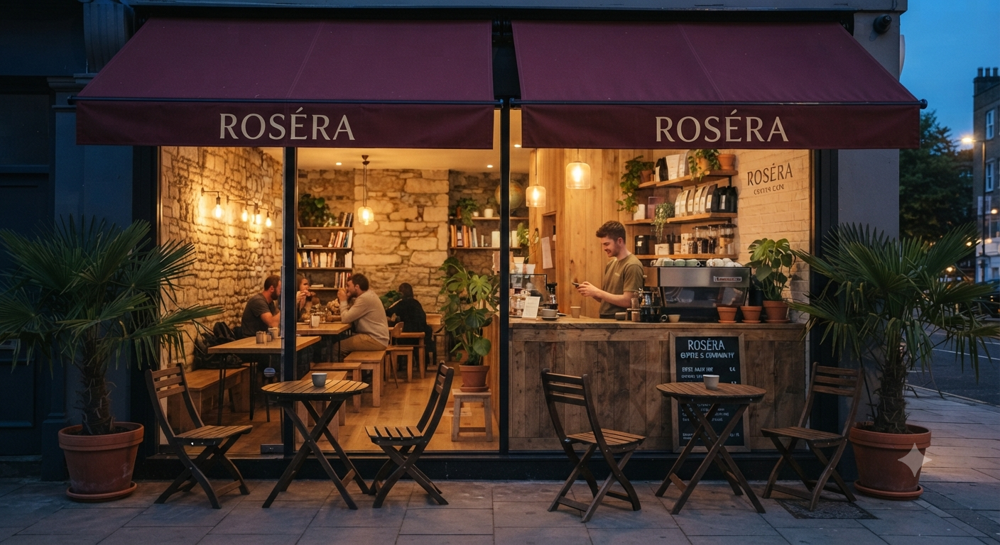

# ☕ Rosera Coffee

A modern and elegant coffee shop website built with **HTML, CSS, and JavaScript**.
The website showcases Rosera Coffee's products, visual branding, and café experience through a clean and responsive interface.

## ✨ Features

* ☕ Modern coffee shop landing page
* 📱 Responsive design for desktop, tablet, and mobile
* 🖼️ Coffee product image showcase
* 🎨 Elegant café-themed UI
* ⚡ Interactive JavaScript functionality
* 🔤 Font Awesome icons
* 📂 Local images and assets
* 🚀 Fast and lightweight frontend

## 🛠️ Technologies Used

* **HTML5** – Website structure
* **CSS3** – Styling, layout and responsive design
* **JavaScript (ES6+)** – Interactions and functionality
* **Font Awesome 7.3.1** – Icons
* **Google Fonts / Custom Fonts** – Typography

## 📁 Project Structure

```text
Rosera-Coffee/
│
├── fontawesome-free-7.3.1-web/
│   ├── css/
│   │   └── all.min.css
│   └── webfonts/
│       └── fa-brands-400.woff2
│
├── images/
│   ├── Bloom-Cappuccino.png
│   ├── Fern-Leaf-Latte.png
│   ├── Heart Latte.png
│   ├── hero image.png
│   ├── hero.png
│   ├── Iced coffee.png
│   ├── logo-icon.jpeg
│   ├── logo-icon.png
│   ├── logo.jpeg
│   └── Mandala-Mocha.png
│
├── database.js
├── index.html
├── script.js
└── style.css
```

## 🚀 How to Run

### 1. Clone the repository

```bash
git clone YOUR_GITHUB_REPOSITORY_URL
```

### 2. Open the project

Open the project folder in VS Code.

### 3. Run the website

You can simply open:

```text
index.html
```

Or use the **Live Server** extension in VS Code.

## 🎨 Main Sections

* Hero Section
* Coffee Menu
* Featured Coffee
* About / Café Section
* Product Showcase
* Contact / Call-to-Action
* Responsive Navigation

## 📸 Project Preview

Add your website screenshot here:

```markdown

```

## 🔮 Future Improvements

* Online table reservation
* Online coffee ordering
* Backend database integration
* Admin dashboard
* Customer authentication
* Payment gateway
* Contact form with email integration
* Google Maps integration

## 👨‍💻 Developer

**Jeetu Rajput**

MERN Stack Developer | Full-Stack Developer | JavaScript Enthusiast

* GitHub: `@jeeturajput101`
* Portfolio: `jeetu-portfolio.vercel.app`

## 📄 License

This project is created for educational, portfolio, and demonstration purposes.
